# Snake and Ladder Game

A comprehensive implementation of the classic Snake and Ladder board game using Java with Strategy Pattern and Builder Pattern for flexible game configuration.

## Features

- Multiple difficulty Game Boards (Easy, Medium, Hard)
- Configurable game rules and strategies
- Support for both Human and Bot players
- Strategy-based design for easy extensibility
- Proper encapsulation and design patterns
- Realistic board layout with snakes and ladders spanning different rows
- Row validation to ensure logical game board structure

## Architecture Overview

This implementation uses several design patterns:

- **Strategy Pattern**: For game rules, winning conditions, collision handling, etc.
- **Builder Pattern**: For flexible game configuration
- **Factory Pattern**: For board creation with different difficulty levels
- **Singleton Pattern**: For dice implementation

## Class Diagram

```mermaid
classDiagram
    %% Core Game Classes
    class Game {
        -Board board
        -ListOfPlayers players
        -DiceService diceService
        -WinningStrategy winStrategy
        -GameStartStrategy startStrategy
        -SpecialRuleStrategy specialRule
        -CollisionStrategy collisionStrategy
        -TurnContinuationStrategy turnContinuationStrategy
        -int currentPlayerIndex
        -Player winner
        -boolean gameOver
        +builder : GameBuilder
        +play : void
        +getWinner : Player
        +isGameOver : boolean
        +getPlayers : ListOfPlayers
        +getBoard : Board
    }

    class GameBuilder {
        -Board board
        -ListOfPlayers players
        -DiceService diceService
        -WinningStrategy winStrategy
        -GameStartStrategy startStrategy
        -SpecialRuleStrategy specialRule
        -CollisionStrategy collisionStrategy
        -TurnContinuationStrategy turnContinuationStrategy
        +withBoard : GameBuilder
        +withPlayers : GameBuilder
        +addPlayer : GameBuilder
        +withDiceService : GameBuilder
        +withWinningStrategy : GameBuilder
        +withStartStrategy : GameBuilder
        +withSpecialRule : GameBuilder
        +withCollisionStrategy : GameBuilder
        +withTurnContinuationStrategy : GameBuilder
        +build : Game
    }

    class GameDemo {
        +main : void
    }

    %% Board and Entities
    class Board {
        -int size
        -MapIntBoardEntity entities
        +addEntity : void
        +copy : Board
        +applyEntity : int
        +getSize : int
        +getEntities : CollectionBoardEntity
        +hasEntity : boolean
        +toString : String
    }

    class BoardFactory {
        -Random random
        +createEasyBoard : Board
        +createMediumBoard : Board
        +createHardBoard : Board
    }

    class BoardEntity {
        <<interface>>
        +getStart : int
        +getEnd : int
        +getType : String
        +apply : int
        +copy : BoardEntity
    }

    class Snake {
        -int head
        -int tail
        +getStart : int
        +getEnd : int
        +getType : String
        +apply : int
        +getHead : int
        +getTail : int
        +copy : BoardEntity
    }

    class Ladder {
        -int bottom
        -int top
        +getStart : int
        +getEnd : int
        +getType : String
        +apply : int
        +getBottom : int
        +getTop : int
        +copy : BoardEntity
    }

    %% Players
    class Player {
        <<interface>>
        +getName : String
        +getPosition : int
        +setPosition : void
        +hasStarted : boolean
        +setStarted : void
        +getConsecutiveSixes : int
        +setConsecutiveSixes : void
        +incrementSixes : void
        +resetSixes : void
        +shouldSkipTurn : boolean
        +setSkipTurn : void
        +reset : void
        +getType : String
        +copy : Player
    }

    class BasePlayer {
        <<abstract>>
        #String name
        #int position
        #boolean started
        #int consecutiveSixes
        #boolean skipTurn
        +getName : String
        +getPosition : int
        +setPosition : void
        +hasStarted : boolean
        +setStarted : void
        +getConsecutiveSixes : int
        +setConsecutiveSixes : void
        +incrementSixes : void
        +resetSixes : void
        +shouldSkipTurn : boolean
        +setSkipTurn : void
        +reset : void
        +toString : String
    }

    class HumanPlayer {
        +getType : String
        +copy : Player
    }

    class BotPlayer {
        +getType : String
        +copy : Player
    }

    %% Dice and Services
    class Dice {
        <<enumeration>>
        INSTANCE
        +roll : int
        +rollMultiple : int
        +rollIndividual : int[]
    }

    class DiceService {
        -int diceCount
        -Dice dice
        +roll : int
        +rollIndividual : int[]
        +contains : boolean
        +getDiceCount : int
    }

    %% Strategy Interfaces
    class WinningStrategy {
        <<interface>>
        +hasWon : boolean
        +getNewPosition : int
    }

    class GameStartStrategy {
        <<interface>>
        +canStart : boolean
        +getRule : String
    }

    class SpecialRuleStrategy {
        <<interface>>
        +apply : boolean
        +getDescription : String
    }

    class TurnContinuationStrategy {
        <<interface>>
        +shouldContinueTurn : boolean
        +getDescription : String
    }

    class CollisionStrategy {
        <<interface>>
        +handle : void
        +getRule : String
    }

    %% Concrete Strategy Implementations
    
    %% Winning Strategy Implementations
    class ExactWinStrategy {
        +hasWon : boolean
        +getNewPosition : int
    }

    class OvershootWinStrategy {
        +hasWon : boolean
        +getNewPosition : int
    }

    %% Game Start Strategy Implementations
    class SixToStartStrategy {
        +canStart : boolean
        +getRule : String
    }

    class NormalStartStrategy {
        +canStart : boolean
        +getRule : String
    }

    %% Special Rule Strategy Implementations
    class RestartOnThreeSixesStrategy {
        +apply : boolean
        +getDescription : String
    }

    class SkipTurnOnThreeSixesStrategy {
        +apply : boolean
        +getDescription : String
    }

    %% Turn Continuation Strategy Implementations
    class RollAgainOnSixStrategy {
        +shouldContinueTurn : boolean
        +getDescription : String
    }

    class NoExtraTurnsStrategy {
        +shouldContinueTurn : boolean
        +getDescription : String
    }

    %% Collision Strategy Implementations
    class KillCollisionStrategy {
        +handle : void
        +getRule : String
    }

    class NoCollisionStrategy {
        +handle : void
        +getRule : String
    }

    %% Relationships
    Game *-- GameBuilder
    Game *-- Board
    Game *-- Player
    Game *-- DiceService
    Game *-- WinningStrategy
    Game *-- GameStartStrategy
    Game *-- SpecialRuleStrategy
    Game *-- TurnContinuationStrategy
    Game *-- CollisionStrategy

    BoardFactory --> Board
    Board *-- BoardEntity

    Snake ..|> BoardEntity
    Ladder ..|> BoardEntity

    BasePlayer ..|> Player
    HumanPlayer --|> BasePlayer
    BotPlayer --|> BasePlayer

    DiceService *-- Dice

    %% Strategy Implementation Relationships
    ExactWinStrategy ..|> WinningStrategy
    OvershootWinStrategy ..|> WinningStrategy

    SixToStartStrategy ..|> GameStartStrategy
    NormalStartStrategy ..|> GameStartStrategy

    RestartOnThreeSixesStrategy ..|> SpecialRuleStrategy
    SkipTurnOnThreeSixesStrategy ..|> SpecialRuleStrategy

    RollAgainOnSixStrategy ..|> TurnContinuationStrategy
    NoExtraTurnsStrategy ..|> TurnContinuationStrategy

    KillCollisionStrategy ..|> CollisionStrategy
    NoCollisionStrategy ..|> CollisionStrategy
```



## Usage Example

```java
// Create a game with medium difficulty board and custom rules
Board board = BoardFactory.createMediumBoard();
DiceService dice = new DiceService(1);

Game game = Game.builder()
    .withBoard(board)
    .addPlayer(new HumanPlayer("Alice"))
    .addPlayer(new BotPlayer("Bot"))
    .withDiceService(dice)
    .withWinningStrategy(new ExactWinStrategy())
    .withStartStrategy(new SixToStartStrategy())
    .withSpecialRule(new RestartOnThreeSixesStrategy())
    .withCollisionStrategy(new KillCollisionStrategy())
    .withTurnContinuationStrategy(new RollAgainOnSixStrategy())
    .build();

game.play();
```

## Board Difficulty Levels

### Easy Board
- 100 squares (10x10 grid)
- 5 ladders, 4 snakes
- All snakes and ladders span multiple rows for realistic gameplay
- Balanced for beginners

### Medium Board
- 100 squares (10x10 grid)
- 8 ladders, 10 snakes
- All entities validated to span different rows
- More challenging gameplay with strategic placement

### Hard Board
- 144 squares (12x12 grid)
- 12 randomly placed ladders
- 15 randomly placed snakes
- All randomly generated entities validated to span multiple rows
- Most challenging experience with larger board and more obstacles

### Row Validation System
- **Ladders**: Always go from a lower row to a higher row
- **Snakes**: Always go from a higher row to a lower row
- **Visual Logic**: Ensures game board makes visual and logical sense
- **Automatic Validation**: Invalid placements are automatically rejected during board generation

## Strategy Implementations

### Winning Strategies
- **ExactWinStrategy**: Must land exactly on the final square
- **OvershootWinStrategy**: Can overshoot to win

### Game Start Strategies
- **SixToStartStrategy**: Must roll a 6 to begin
- **NormalStartStrategy**: Can start with any roll

### Special Rule Strategies
- **RestartOnThreeSixesStrategy**: Player restarts from position 0 after 3 consecutive sixes
- **SkipTurnOnThreeSixesStrategy**: Player skips next turn after 3 consecutive sixes

### Turn Continuation Strategies
- **RollAgainOnSixStrategy**: Player gets another turn when rolling a 6
- **NoExtraTurnsStrategy**: No extra turns regardless of roll

### Collision Strategies
- **KillCollisionStrategy**: Landing on another player sends them back to start
- **NoCollisionStrategy**: Players can occupy the same position

## Design Patterns Used

1. **Strategy Pattern**: Allows different game rules to be swapped at runtime
2. **Builder Pattern**: Provides flexible game configuration
3. **Factory Pattern**: Encapsulates board creation logic with proper encapsulation
4. **Singleton Pattern**: Ensures single dice instance
5. **Template Method Pattern**: BasePlayer provides common player behavior

## BoardFactory Encapsulation

The `BoardFactory` class follows proper encapsulation principles:

- **Private Enum**: `Difficulty` enum is private and not accessible from outside
- **Public Methods**: Three public static methods for creating different difficulty boards:
  - `createEasyBoard()` - Creates easy difficulty board
  - `createMediumBoard()` - Creates medium difficulty board  
  - `createHardBoard()` - Creates hard difficulty board
- **Clean Interface**: Simple method calls like `BoardFactory.createMediumBoard()`
